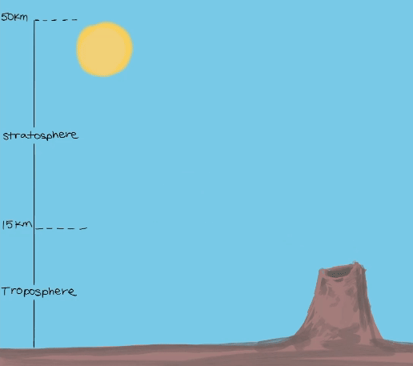
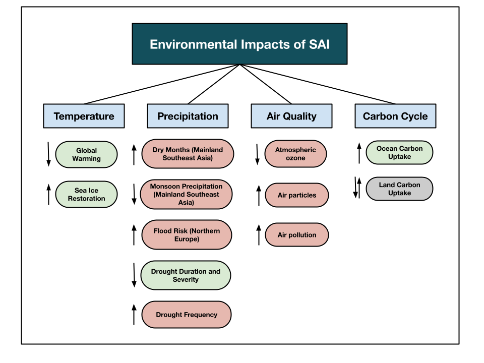
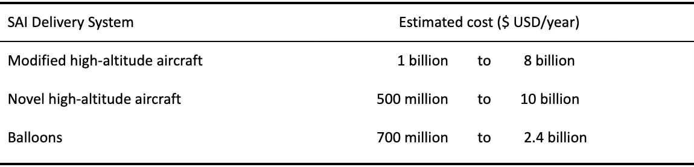
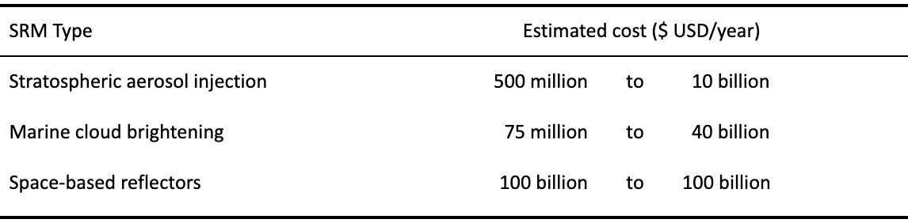

# Feasibility and Implications of Stratospheric Aerosol Injection
*Zoe Iczkovitz, Alesia Leung, Maya Mahmood, Alyssia Naran, and Priya Rai*

Global warming, driven by greenhouse gas emissions, is causing severe climate impacts worldwide. One proposed strategy to adapt to climate change is solar radiation management (SRM), which manages incoming solar radiation by increasing the reflectivity of Earth’s surface, also called albedo (Pope et al. 2012). 

Stratospheric aerosol injection (SAI) is an SRM strategy that introduces aerosols, typically sulfur dioxide (SO2), into the stratosphere to increase Earth's albedo (Figure 1) (Vattioni et al. 2024). SAI aims to mimic the cooling effect of volcanic eruptions, which release sulfur plumes that reflect incoming solar radiation (Ming et al. 2014). While environmental models suggest SAI could limit global warming, environmental, social, technological, geopolitical, and financial factors must be considered.

*Figure 1. SAI works by injecting aerosols, including sulfur dioxide (SO2), into the stratosphere (15 to 50 km above Earth’s surface), through injection mechanisms such as drones, tethered balloons, and aircrafts. This is meant to mimic the cooling effects of large volcanic eruptions. Incoming solar radiation is then able to be reflected off of aerosol particles which creates a cooling effect (Ming et al. 2014) (Authors’ Own Work).* 

## Technological Feasibility

The technological feasibility of SAI relies on efficient delivery methods, optimal locations, and long-term monitoring. Aerosols, such as SO2, could be delivered to the stratosphere via aircraft, drones, or balloons. Aircrafts offer large-scale delivery but would require significant modifications, while drones and balloons provide flexibility and lower costs (Lockley, MacMartin, and Hunt 2020). Ideal injection locations are remote, stable regions, such as oceanic areas, to minimize risks and ensure predictable aerosol dispersion (Zhang et al. 2024). Additionally, to maintain effective cooling, continuous monitoring is essential to track aerosol concentrations and their long-term impact.

## Environmental Impacts
SAI affects the environment by altering temperature, precipitation, air quality, and the carbon cycle (Figure 2). While it can reduce global temperatures and mitigate droughts, it may lead to regional disparities such as drying in Mainland Southeast Asia or flooding in Northern Europe (Narenpitak et al. 2024; Liu, Lang, and Jiang 2024). These changes pose risks to ecosystems, agriculture, and water resources (Clark et al. 2023). Abrupt termination of SAI, known as "Termination Shock," could severely worsen global warming and accelerate CO2 release (Tang and Kemp 2021). 

*Figure 2. Potential environmental impacts of SAI across major categories. Temperature: SAI can reduce global warming by reflecting sunlight and aiding in the restoration of sea ice (Lee et al. 2023; Zhang et al. 2024). Precipitation: SAI alters rainfall patterns, increasing dry months and reducing monsoon precipitation in Mainland Southeast Asia, while intensifying flood risks in Northern Europe. It also globally modifies drought frequency, duration, and severity (Narenpitak et al. 2024; Liu, Lang, and Jiang 2024). Air Quality: SAI depletes atmospheric ozone and contributes to air pollution (Tracy et al. 2022). Carbon Cycle: SAI enhances ocean carbon uptake, but it has mixed effects on land carbon uptake (Cao 2018). However, these impacts carry some uncertainties, as they come from different climate models with varying parameters. Further, the extent and distribution of environmental effects depend on the scale, strategy, and location of SAI injections (Authors’ Own Work).*

## Geopolitical Considerations 
The global impacts of SAI require a decision-making process that is inclusive of all nations (Flegal and Gupta 2018; Smith et al. 2022). Although international organizations have advised the need for governance, there is yet to be a collective approach to SAI research, planning, and deployment (Frumhoff and Stephens 2018; Kravitz et al. 2014; Smith et al. 2022). Conflicting environmental goals further reduce the political motivation of politicians to engage in such governance (Reynolds 2019). 

## Financial Considerations
As mentioned, SAI can be deployed by various delivery systems, with annual operational costs summarized in Table 1. 

*Table 1. Estimated annual cost of various stratospheric aerosol injection (SAI) delivery systems in USD.*

Data from Smith (2020); McClellan, Keith, and Apt (2012).

In comparison to other popular SRMs, SAI is generally considered one of the more economically feasible and extensively researched options, as shown in Table 2 (Amis et al. 2019). 

*Table 2. Estimated annual cost of various solar radiation management (SRM) techniques in USD.*

 
Data from Smith (2020); McClellan, Keith, and Apt (2012); Shepherd et al. (2009); Smith et al. (2022); Claudel et al. (2024); Salter, Sortino, and Latham (2008); Angel (2006); Fuglesang and de Herreros Miciano (2021).

## Social Impacts

SAI raises social considerations regarding ethics, public perceptions, and unintended environmental and health impacts. For instance, elite groups may dominate decision-making, marginalizing vulnerable populations most affected by SAI’s negative consequences (Grasso 2022). Decisions on SAI implementation must equitably include diverse cultural and socioeconomic perspectives (Grasso 2022). SAI can also create a "moral hazard" where reliance on technological fixes undermines mitigation efforts (Corner and Pidgeon 2010). Additionally, the environmental risks of SAI could exacerbate health disparities in communities lacking the resources to manage additional public health issues (Carlson et al. 2022). 

## Recommendations and Conclusions

While theoretically capable of reducing global temperatures, SAI faces significant uncertainties, including technical, geopolitical, and environmental risks, as well as the potential to exacerbate inequalities and hinder mitigation efforts. Instead of relying on SAI, global strategies should prioritize addressing the root causes of climate change through proven solutions like reducing greenhouse gases, as well as adopting renewable energy and sustainable practices for meaningful and lasting impact (Corner and Pidgeon 2010).

## References

Amis, Tony, Masoud Babaei, Subhamoy Bhattacharya, Miguel Brandão, Antoine Buchard, Sylvain Caillol, Robert Chris, et al. 2019. Managing Global Warming: An Interface of Technology and Human Issues. Edited by Trevor M. Letcher. Academic Press. https://doi.org/10.1016/B978-0-12-814104-5.09990-7.

Angel, Roger. 2006. “Feasibility of Cooling the Earth with a Cloud of Small Spacecraft near the Inner Lagrange Point (L1).” Proceedings of the National Academy of Sciences of the United States of America 103 (46): 17184. https://doi.org/10.1073/pnas.0608163103.
Cao, Long. 2018. “The Effects of Solar Radiation Management on the Carbon Cycle.” Current Climate Change Reports 4 (1): 41–50. https://doi.org/10.1007/s40641-018-0088-z.

Carlson, Colin J., Rita Colwell, Mohammad Sharif Hossain, Mohammed Mofizur Rahman, Alan Robock, Sadie J. Ryan, Mohammad Shafiul Alam, and Christopher H. Trisos. 2022. “Solar Geoengineering Could Redistribute Malaria Risk in Developing Countries.” Nature Communications 13 (1): 2150. https://doi.org/10.1038/s41467-022-29613-w.

Clark, Brendan, Lili Xia, Alan Robock, Simone Tilmes, Jadwiga H. Richter, Daniele Visioni, and Sam S. Rabin. 2023. “Optimal Climate Intervention Scenarios for Crop Production Vary by Nation.” Nature Food 4 (10): 902–11. https://doi.org/10.1038/s43016-023-00853-3.
Claudel, Christian, Andrew Lockley, Fabian Hoffmann, and Younan Xia. 2024. “Marine-Cloud Brightening: An Airborne Concept.” Environmental Research Communications 6 (3): 035020. https://doi.org/10.1088/2515-7620/ad2f71.

Corner, Adam, and Nick Pidgeon. 2010. “Geoengineering the Climate: The Social and Ethical Implications.” Environment: Science and Policy for Sustainable Development 52 (1): 24–37. https://doi.org/10.1080/00139150903479563.

Flegal, Jane A., and Aarti Gupta. 2018. “Evoking Equity as a Rationale for Solar Geoengineering Research? Scrutinizing Emerging Expert Visions of Equity.” International Environmental Agreements: Politics, Law and Economics 18 (1): 45–61. https://doi.org/10.1007/s10784-017-9377-6.

Frumhoff, Peter C., and Jennie C. Stephens. 2018. “Towards Legitimacy of the Solar Geoengineering Research Enterprise | Philosophical Transactions of the Royal Society A: Mathematical, Physical and Engineering Sciences.” The Royal Society, April. https://doi.org/10.1098/rsta.2016.0459.

Fuglesang, Christer, and María García de Herreros Miciano. 2021. “Realistic Sunshade System at L1 for Global Temperature Control.” Acta Astronautica 186 (September):269–79. https://doi.org/10.1016/j.actaastro.2021.04.035.

Grasso, Marco. 2022. “Legitimacy and Procedural Justice: How Might Stratospheric Aerosol Injection Function in the Public Interest?” Humanities and Social Sciences Communications 9 (1): 1–9. https://doi.org/10.1057/s41599-022-01213-5.
Kravitz, Ben, Douglas G. MacMartin, Alan Robock, Philip J. Rasch, Katharine L. Ricke, Jason N. S. Cole, Charles L. Curry, et al. 2014. “A Multi-Model Assessment of Regional Climate Disparities Caused by Solar Geoengineering.” Environmental Research Letters 9 (7): 074013. https://doi.org/10.1088/1748-9326/9/7/074013.

Lee, Walker Raymond, Douglas G. MacMartin, Daniele Visioni, Ben Kravitz, Yating Chen, John C. Moore, Gunter Leguy, David M. Lawrence, and David A. Bailey. 2023. “High-Latitude Stratospheric Aerosol Injection to Preserve the Arctic.” Earth’s Future 11 (1): e2022EF003052. https://doi.org/10.1029/2022EF003052.

Liu, Zhaochen, Xianmei Lang, and Dabang Jiang. 2024. “Stratospheric Aerosol Injection Geoengineering Would Mitigate Greenhouse Gas-Induced Drying and Affect Global Drought Patterns.” Journal of Geophysical Research: Atmospheres 129 (3): e2023JD039988. https://doi.org/10.1029/2023JD039988.

Lockley, Andrew, Doug MacMartin, and Hugh Hunt. 2020. “An Update on Engineering Issues Concerning Stratospheric Aerosol Injection for Geoengineering.” Environmental Research Communications 2 (8): 082001. https://doi.org/10.1088/2515-7620/aba944.
McClellan, Justin, David W. Keith, and Jay Apt. 2012. “Cost Analysis of Stratospheric Albedo Modification Delivery Systems.” Environmental Research Letters 7 (3): 034019. https://doi.org/10.1088/1748-9326/7/3/034019.

Ming, Tingzhen, Renaud de_Richter, Wei Liu, and Sylvain Caillol. 2014. “Fighting Global Warming by Climate Engineering: Is the Earth Radiation Management and the Solar Radiation Management Any Option for Fighting Climate Change?” Renewable and Sustainable Energy Reviews 31 (March):792–834. https://doi.org/10.1016/j.rser.2013.12.032.

Narenpitak, Pornampai, Siriwat Kongkulsiri, Saifhon Tomkratoke, and Sirod Sirisup. 2024. “Regional Impacts of Solar Radiation Modification on Surface Temperature and Precipitation in Mainland Southeast Asia and the Adjacent Oceans.” Scientific Reports 14 (1): 22713. https://doi.org/10.1038/s41598-024-73149-6.

Pope, F. D., P. Braesicke, R. G. Grainger, M. Kalberer, I. M. Watson, P. J. Davidson, and R. A. Cox. 2012. “Stratospheric Aerosol Particles and Solar-Radiation Management.” Nature Climate Change 2 (10): 713–19. https://doi.org/10.1038/nclimate1528.
Reynolds, Jesse L. 2019. “Solar Geoengineering to Reduce Climate Change: A Review of Governance Proposals.” Proceedings of the Royal Society A: Mathematical, Physical and Engineering Sciences 475 (2229): 20190255. https://doi.org/10.1098/rspa.2019.0255.

Salter, Stephen, Graham Sortino, and John Latham. 2008. “Sea-Going Hardware for the Cloud Albedo Method of Reversing Global Warming.” Philosophical Transactions of the Royal Society A: Mathematical, Physical and Engineering Sciences 366 (1882): 3989–4006. https://doi.org/10.1098/rsta.2008.0136.

Shepherd, John, Ken Caldeira, Peter Cox, Joanna Haigh, David Keith, Brian Launder, Georgina Mace, et al. 2009. Geoengineering the Climate: Science, Governance and Uncertainty. London: Royal Society of London.
Smith, Wake. 2020. “The Cost of Stratospheric Aerosol Injection through 2100.” Environmental Research Letters 15 (11): 114004. https://doi.org/10.1088/1748-9326/aba7e7.

Smith, Wake, Umang Bhattarai, Douglas G. MacMartin, Walker Raymond Lee, Daniele Visioni, Ben Kravitz, and Christian V. Rice. 2022. “A Subpolar-Focused Stratospheric Aerosol Injection Deployment Scenario.” Environmental Research Communications 4 (9): 095009. https://doi.org/10.1088/2515-7620/ac8cd3.

Tang, Aaron, and Luke Kemp. 2021. “A Fate Worse Than Warming? Stratospheric Aerosol Injection and Global Catastrophic Risk.” Frontiers in Climate 3 (November). https://doi.org/10.3389/fclim.2021.720312.

Tracy, Samantha M., Jonathan M. Moch, Sebastian D. Eastham, and Jonathan J. Buonocore. 2022. “Stratospheric Aerosol Injection May Impact Global Systems and Human Health Outcomes.” Elementa: Science of the Anthropocene 10 (1): 00047. https://doi.org/10.1525/elementa.2022.00047.
Vattioni, S., S. K. Käslin, J. A. Dykema, L. Beiping, T. Sukhodolov, J. Sedlacek, F. N. Keutsch, T. Peter, and G. Chiodo. 2024. “Microphysical Interactions Determine the Effectiveness of Solar Radiation Modification via Stratospheric Solid Particle Injection.” Geophysical Research Letters 51 (19): e2024GL110575. https://doi.org/10.1029/2024GL110575.

Zhang, Yan, Douglas G. MacMartin, Daniele Visioni, Ewa M. Bednarz, and Ben Kravitz. 2024. “Hemispherically Symmetric Strategies for Stratospheric Aerosol Injection.” Earth System Dynamics 15 (2): 191–213. https://doi.org/10.5194/esd-15-191-2024.

